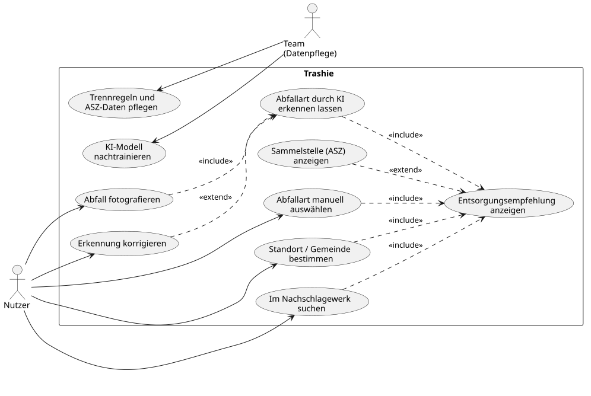
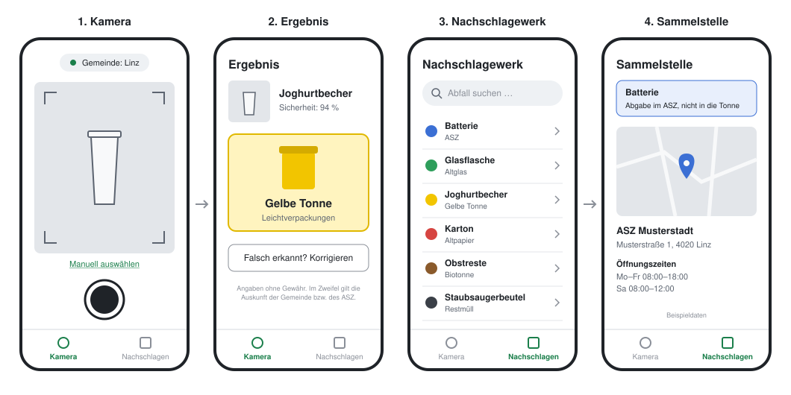

Kerimcan Yagci, Nico Haider, Milan Nuzdic, Jan Brunner und Mario Solomun

## 1. Ausgangssituation

In Österreich ist jeder Haushalt verpflichtet, seinen Abfall getrennt zu entsorgen. Organisiert wird die Abfallentsorgung auf Gemeindeebene: In Oberösterreich sind dafür die Gemeinden bzw. die jeweiligen Bezirksabfallverbände zuständig, in Linz übernimmt dies die Linz AG. Getrennt wird typischerweise in Restmüll, Bioabfall, Altpapier, Leichtverpackungen (Gelbe Tonne bzw. Gelber Sack) und Altglas. Alles, was nicht in die Haushaltstonnen gehört, etwa Elektroaltgeräte, Batterien, Problemstoffe, Sperrmüll oder Altholz, wird in Altstoffsammelzentren (ASZ) bzw. Recyclinghöfen abgegeben.

## 2. Istzustand

Welche Fraktionen direkt beim Haushalt abgeholt und welche zu Sammelinseln oder ins ASZ gebracht werden, legt jede Gemeinde selbst fest. Die Zuordnung eines konkreten Gegenstandes erfolgt derzeit durch die Person selbst: Sie schlägt in einer der verfügbaren Quellen nach oder verlässt sich auf ihr bisheriges Wissen.

Folgende Informationsquellen stehen aktuell zur Verfügung:

| Quelle | Stärken | Schwächen |
|--------|---------|-----------|
| **Abfallkalender, Trennblätter und Trenn-ABCs** der Gemeinden bzw. Abfallverbände (gedruckt oder als PDF) | offizielle, für die Gemeinde gültige Angaben | lange Listen, der Gegenstand muss selbst gesucht und richtig benannt werden |
| **Webseiten** der Gemeinden, Bezirksabfallverbände und Entsorgungsunternehmen | aktuell und ausführlich | für jede Gemeinde eine andere Seite mit anderem Aufbau |
| **Regionale Abfall-Apps** | Abholtermine und Erinnerungen | beantworten meist nicht, wohin ein konkreter Gegenstand gehört |
| **Aufdrucke und Symbole** auf Verpackungen | direkt am Gegenstand | nicht auf jedem Gegenstand vorhanden, nicht auf die Regeln der Gemeinde abgestimmt |
| **Auskunft des ASZ-Personals** | verlässlich und individuell | nur vor Ort und während der Öffnungszeiten |

Keine dieser Quellen erkennt einen Gegenstand selbstständig und verknüpft ihn mit den am jeweiligen Ort geltenden Regeln.

### 2.1 Beispiel: Stadtgemeinde Freistadt

Wie unterschiedlich die Entsorgung schon innerhalb eines Bezirks geregelt ist, zeigt die Stadtgemeinde Freistadt im Mühlviertel. Zuständig sind hier zwei Stellen: die Stadtgemeinde selbst und der Bezirksabfallverband (BAV) Freistadt.

- **Abholung beim Haushalt**: Restmüll und Gelber Sack werden abgeholt. Die Termine veröffentlicht die Stadtgemeinde auf ihrer [Webseite](https://www.freistadt.at/de/Leben_in_Freistadt/Umwelt/Muellabfuhrtermine), abrufbar je Straße oder als PDF-Kalender für das ganze Jahr.
- **Abgabe im ASZ**: Altstoffe, Problemstoffe und sperrige Abfälle werden über die Altstoffsammelzentren des [BAV Freistadt](https://www.umweltprofis.at/freistadt/ueber_uns/bezirksabfallverband.html) gesammelt.
- **Unterschied zu den Nachbargemeinden**: Im Bezirk Freistadt gilt großteils ein Bringsystem, bei dem auch der Restmüll selbst ins ASZ gebracht wird. Die Stadt Freistadt gehört zu den wenigen Gemeinden des Bezirks mit eigener Müllabfuhr ([MeinBezirk, 27.03.2026](https://www.meinbezirk.at/freistadt/c-lokales/bav-obmann-stellt-klar-bringsystem-hat-hohe-akzeptanz_a8556835)).

Wer in Freistadt wissen möchte, wohin ein Gegenstand gehört, muss also zuerst wissen, ob er abgeholt wird oder ins ASZ gehört, und dann bei der jeweils zuständigen Stelle nachschlagen. Wer aus einer Nachbargemeinde zuzieht oder dorthin umzieht, findet bereits beim Restmüll eine andere Regelung vor.

## 3. Problemstellung

Die korrekte Trennung von Abfall ist für viele Menschen im Alltag schwierig, weil sich die Regeln je nach Gemeinde bzw. zuständigem Entsorgungsunternehmen unterscheiden und die vorhandenen Informationen verstreut sind.

Daraus ergeben sich folgende Probleme:

- **Unsicherheit**: Es ist oft unklar, in welche Tonne oder zu welcher Sammelstelle ein Gegenstand gehört, besonders bei Verbundstoffen oder selten anfallenden Gegenständen.
- **Uneinheitliche Regeln**: Was in Linz gilt, gilt nicht automatisch im restlichen Oberösterreich oder im Mühlviertel.
- **Fehlwürfe**: Falsch entsorgte Gegenstände erschweren das Recycling, Wertstoffe gehen verloren. Im schlimmsten Fall entstehen Gefahren, z. B. Brände durch Lithium-Akkus im Restmüll.
- **Kein zentrales Nachschlagewerk**: Für Privatpersonen gibt es keine einzelne, leicht zugängliche Stelle, an der sie schnell eine Antwort bekommen.
- **Hoher Rechercheaufwand**: Das Nachschlagen dauert länger als das Wegwerfen, daher wird im Zweifel geraten.
- **Neu Zugezogene**: Personen, die neu in eine Region ziehen oder sich nur vorübergehend dort aufhalten (z. B. Studierende), kennen die lokalen Regeln nicht.

## 4. Aufgabenstellung

Es soll eine mobile App entwickelt werden, die Abfall anhand eines Fotos erkennt und dem Nutzer sagt, wie und wo der Gegenstand richtig zu entsorgen ist. Dazu verknüpft die App das Ergebnis eines eigens nachtrainierten KI-Modells mit dem Standort des Nutzers und den dort hinterlegten Trennregeln zu einer konkreten Entsorgungsempfehlung. Zusätzlich dient die App als Nachschlagewerk, das auch ohne Internetverbindung funktioniert.

Pilotregion ist Linz, Oberösterreich und das Mühlviertel.

### 4.1 Funktionale Anforderungen

- **Foto-Analyse mittels KI**: Der Nutzer fotografiert einen Abfallgegenstand mit der Kamera der App. Ein nachtrainiertes KI-Modell klassifiziert das Bild und ordnet es einer der definierten Abfallkategorien zu. Zum Ergebnis wird angezeigt, wie sicher sich das Modell ist.

- **Manuelle Auswahl und Korrektur**: Liegt die Sicherheit der Erkennung unter einem festgelegten Schwellwert, bietet die App statt einer Empfehlung die manuelle Auswahl der Abfallkategorie an. Auch ein angezeigtes Ergebnis kann der Nutzer jederzeit korrigieren, indem er eine andere Kategorie auswählt.

- **Standorterkennung**: Die App ermittelt über GPS die Gemeinde, in der sich der Nutzer befindet, und damit die dort geltenden Trennregeln sowie das zuständige Entsorgungsunternehmen. Verweigert der Nutzer die Standortfreigabe oder ist kein GPS-Signal verfügbar, kann die Gemeinde manuell ausgewählt werden.

- **Entsorgungsempfehlung**: Aus Abfallkategorie, Standort und hinterlegten Regeln ergibt sich eine konkrete Empfehlung. Sie nennt die richtige Tonne bzw. den richtigen Container mit Bezeichnung und Farbe bzw. Symbol. Jede Empfehlung enthält den Hinweis, dass die Angaben ohne Gewähr sind und im Zweifel die Auskunft der Gemeinde bzw. des ASZ gilt.

- **Hinweis auf Sammelstellen**: Kann ein Gegenstand nicht über eine Haushaltstonne entsorgt werden, weist die App ihn als ASZ-Abgabe aus und zeigt die passende Sammelstelle mit Adresse und Öffnungszeiten an.

- **Nachschlagewerk**: Alle Abfallkategorien und ihre Zuordnung können in einer Liste durchsucht werden. Die Suche filtert die Einträge bereits während der Eingabe. Das Nachschlagewerk ist auch ohne Internetverbindung nutzbar.

- **Bereitstellung der Regeldaten**: Trennregeln, Abfallkategorien und ASZ-Daten werden zentral im Backend gepflegt und der App über eine REST-Schnittstelle bereitgestellt. Zu jeder Regel sind Quelle und Abrufdatum hinterlegt. Die App speichert die zuletzt geladenen Daten lokal, damit sie auch offline zur Verfügung stehen.

### 4.2 Nicht funktionale Anforderungen

- **Bedienbarkeit**: Vom Start der App bis zur Entsorgungsempfehlung sind maximal 3 Interaktionsschritte nötig (App öffnen, fotografieren, Ergebnis lesen). Die App ist ohne Anleitung oder Einführung bedienbar. Dies wird durch Nutzertests mit mindestens 5 Testpersonen überprüft, die nicht dem Projektteam angehören.

- **Kompatibilität**: Die App läuft auf Android und iOS und wird aus einer gemeinsamen Codebasis gebaut. Sie ist für die Bedienung im Hochformat auf dem Smartphone ausgelegt.

- **Performance**: Zwischen dem Auslösen des Fotos und der Anzeige der Empfehlung vergehen auf einem aktuellen Mittelklasse-Smartphone höchstens 3 Sekunden. Die Suche im Nachschlagewerk liefert Ergebnisse in unter 200 ms.

- **Erkennungsgenauigkeit**: Das KI-Modell erreicht auf dem Testdatensatz die im [Projektmanagement]({{ '/management/' | relative_url }}) für Meilenstein M3 festgelegte Mindestgenauigkeit. Unsichere Ergebnisse werden nicht als Empfehlung ausgegeben, sondern führen zur manuellen Auswahl.

- **Offline-Fähigkeit**: Das Nachschlagewerk und die Empfehlung auf Basis der zuletzt geladenen Regeln funktionieren ohne Internetverbindung.

- **Datenschutz**: Standortdaten und Fotos werden DSGVO-konform verarbeitet. Kamera und Standort werden erst nach Einwilligung des Nutzers verwendet. Koordinaten dienen ausschließlich zur Ermittlung der Gemeinde und werden nicht gespeichert. Fotos werden nach der Klassifikation nicht aufbewahrt, die Klassifikation erfolgt nach Möglichkeit direkt am Gerät. Die App enthält eine Datenschutzerklärung. Es ist kein Nutzerkonto erforderlich.

- **Aktualität der Regeln**: Geänderte Trennregeln können im Backend eingepflegt werden, ohne dass eine neue Version der App veröffentlicht werden muss.

- **Rechtliche Abgrenzung**: Die App erweckt nicht den Eindruck einer offiziellen App der Gemeinden oder Entsorgungsunternehmen und verwendet keine fremden Logos, Texte oder Grafiken.

#### 4.2.1 GUI

Die App besteht aus folgenden Ansichten:

| Ansicht | Inhalt |
|---------|--------|
| **Kamera (Startansicht)** | Kamerabild mit Auslöser, Anzeige der aktuell erkannten Gemeinde, Zugang zur manuellen Auswahl |
| **Ergebnis** | erkannte Abfallkategorie mit Sicherheit, richtige Tonne bzw. Container mit Farbe und Symbol, Möglichkeit zur Korrektur, Hinweis „ohne Gewähr“ |
| **Manuelle Auswahl** | Liste der Abfallkategorien, wird bei unsicherer Erkennung oder zur Korrektur angezeigt |
| **Nachschlagewerk** | durchsuchbare Liste aller Abfallkategorien mit ihrer Zuordnung |
| **Sammelstelle** | Adresse und Öffnungszeiten des passenden ASZ |

Zwischen Kamera und Nachschlagewerk wechselt der Nutzer über eine jederzeit sichtbare Navigationsleiste.

## 5. Ziele

- **Zeit sparen**: Die Antwort auf die Frage „Wohin damit?“ dauert Sekunden statt einer Recherche in Trennblättern und auf Webseiten.
- **Weniger Fehlwürfe**: Abfall landet häufiger in der richtigen Tonne, Wertstoffe bleiben im Kreislauf und das Recycling wird effizienter.
- **Eine zentrale Anlaufstelle**: Die Regeln der Pilotregion sind an einem Ort gesammelt und jederzeit abrufbar, auch ohne Internetverbindung.
- **Regeln passend zum Ort**: Der Nutzer erhält die Empfehlung, die in seiner Gemeinde gilt, ohne die lokalen Regeln selbst kennen zu müssen.
- **Bewusstsein schaffen**: Die Nutzung der App sensibilisiert für Recycling und Nachhaltigkeit.
- **Kostenlos nutzbar**: Die App ist für Nutzer kostenlos und wird ausschließlich mit kostenlosen bzw. Open-Source-Werkzeugen umgesetzt.

## 6. Mengengerüst

Die folgenden Werte sind Schätzungen für die Pilotphase.

| Größe | Menge |
|-------|-------|
| Gemeinden in der Pilotregion | 438 (alle Gemeinden Oberösterreichs) |
| Abfallkategorien (Klassen des KI-Modells) | ca. 20 bis 30 |
| Trennregeln | eine Zuordnung je Abfallkategorie und Regelgebiet, in Summe einige Tausend Einträge |
| Trainingsbilder | ca. 300 je Abfallkategorie, in Summe ca. 6.000 bis 9.000 |
| Nutzer in der Pilotphase | einige Hundert |
| Analysen pro Nutzer | ca. 2 bis 5 pro Woche |

Datenbestände:

- **Regeldaten**: Text (Abfallkategorien, Tonnen und Container, Trennregeln mit Quelle und Abrufdatum)
- **ASZ-Daten**: Text und Koordinaten (Standorte, Öffnungszeiten, angenommene Abfallarten)
- **Trainingsdaten**: gelabelte Bilder, aufgeteilt in Trainings-, Validierungs- und Testdaten
- **KI-Modell**: eine Modelldatei, die mit der App ausgeliefert wird

Nutzerbezogene Daten (Fotos, Standorte, Konten) werden nicht gespeichert.

## 7. Rahmenbedingungen

### 7.1 Technische

- **Frontend**: C# mit .NET MAUI, eine gemeinsame Codebasis für Android und iOS
- **Backend**: Java mit Spring Boot, Bereitstellung der Daten über eine REST-Schnittstelle
- **KI-Modell**: Fine-Tuning eines bestehenden, vortrainierten Bildklassifikationsmodells, kein Training von Grund auf
- **Kein Budget**: Es werden ausschließlich kostenlose bzw. Open-Source-Werkzeuge verwendet, für das KI-Training stehen nur kostenlose GPU-Angebote mit Limits zur Verfügung
- **Lizenzen**: Basismodell, Bibliotheken, Trainingsdaten und Regeldaten müssen lizenzrechtlich zum Projekt passen
- **Versionsverwaltung und Backlog**: Git und GitHub, Backlog-Verwaltung über GitHub Projects

Die Begründungen der Technologieentscheidungen sind in der [Architektur]({{ '/architecture/' | relative_url }}) beschrieben.

### 7.2 Zeitliche

- Start des Projektes: Mitte Oktober 2026
- Erster Prototyp: März 2027
- Ende des Projektes: März 2028
- Umsetzung im Rahmen des SYP-Unterrichts nach Scrum, die Meilensteine sind im [Projektmanagement]({{ '/management/' | relative_url }}) beschrieben

---
*last change: 06.10.2026*

---
[← Übersicht]({{ '/' | relative_url }}) · [Projektantrag]({{ '/project-proposal/' | relative_url }}) · [Management]({{ '/management/' | relative_url }}) · [Architektur]({{ '/architecture/' | relative_url }})
